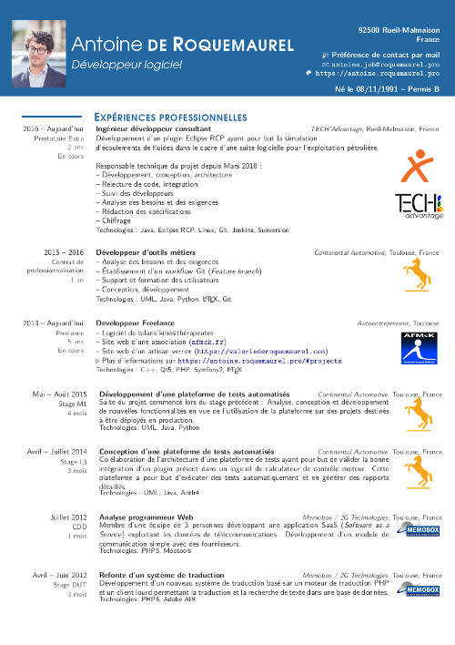
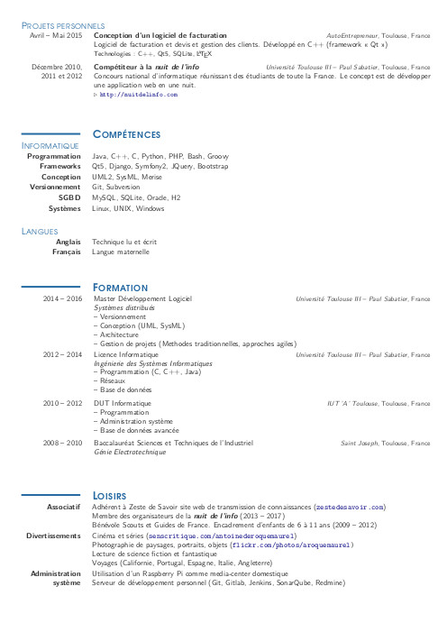

Curriculum-VItae
================

A CV written in LaTex, you can download it [here](https://github.com/aroquemaurel/Curriculum-VItae/raw/master/src/cv.pdf). 

The src folder contains : 

- anonymous_contact.tex,  the file with contact informations 
- cv.tex, the contents of CV
- cv_theme.cls, the theme of CV

|  |  |
| --------------------------------- | --------------------------------- |
|                                   |                                   |

